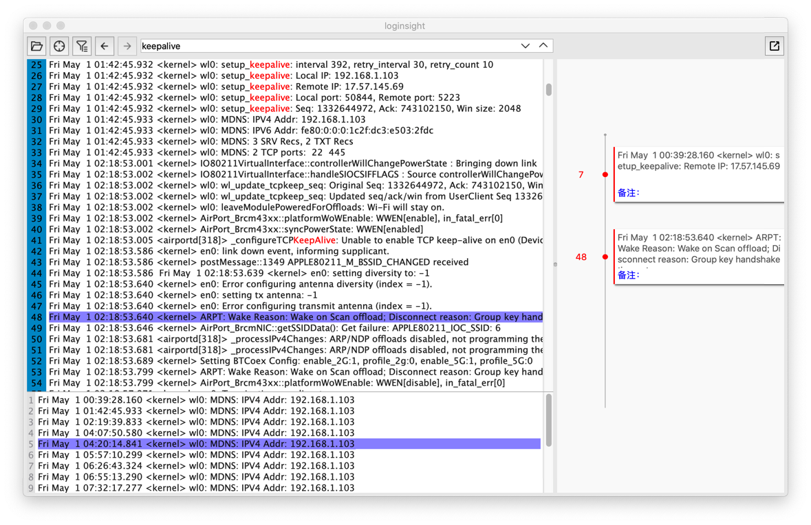

loginsight致力于打造一款日志分析的利器

亮点特性：

- 支持大文件（目标支持最大4G文件），已支持500M以下文件秒开
- 时间线功能，日志再乱，思路清晰
- 日志过滤、高亮关键字、搜索，基础功能完备
- 基于Qt跨平台，快速高性能
- 切割日志的合并打开（待开发）
- 日志格式化高亮（待开发）
- 自动分析（待开发）

看日志最大的痛点是大文件支持差，用编辑器开几十M的日志都要等半天，几百M可能内存就扛不住了；VIM还算不错，开个几百M还可应付，不过VIM毕竟只有少数人用的溜。

第二个痛点是，查日志重在找线索，发现问题原因，但用编辑器看日志远远不够。我们需要一个“线索板”时刻帮忙记录、整理思路。这个项目的“时间线”功能就是一个初级的实现方案。更智能一些，是不是可以让工具帮忙找到特定的出错模式呢？

针对上面这两个问题/需求，我决定把我用VIM查日志的经验转换为一个工具，并在这个工具的加入更多辅助查日志的好用功能。

进展：大文件的加载、滚动、搜索、高亮、过滤等难点问题已经攻克；时间线功能已经有点样子了。可以正常编译运行了。

接下来，要花精力先把基础的功能（搜索、过滤、时间线等）调优下，然后发布1.0版本。

如果觉得这个项目可能对你会有帮助，请支持我：

1. 可以在issue里提需求
2. 可以在issue里针给TODO列表中标`*`的项提实现方案（请先阅读代码了解难点后再提）
3. 给开发者点杯咖啡，加个油（赞赏时可以在备注提需求，所提需求将被优先实现）：

TODO:

- [ ] 基础功能完善和优化
- [ ] `*`支持更大文件秒开
- [ ] 时间线支持自定义格式信息提取（提取日期、进程、TAG等）
- [ ] `*`日志格式化高亮
- [ ] `*`自动分析
- [ ] `*`流式日志支持（如adb logcat）（待定）

PS：

如果你在GitHub上看不到图片、速度慢；可以移步到镜像仓库：https://gitee.com/compilelife/loginsight

如果在release页面下载速度慢，可以移步百度网盘下载:

链接: https://pan.baidu.com/s/1DzKTmmVL34qQdHKlrs8LCg 提取码: x46v
